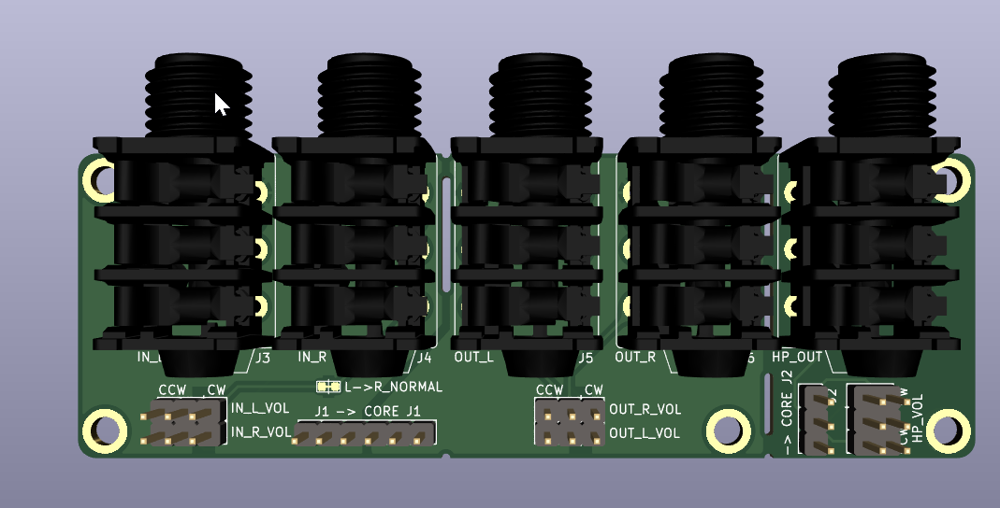
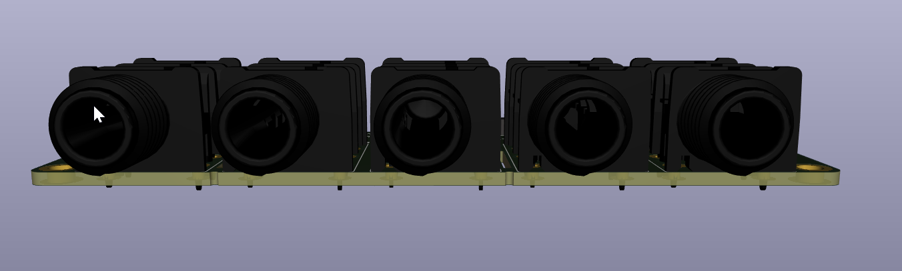
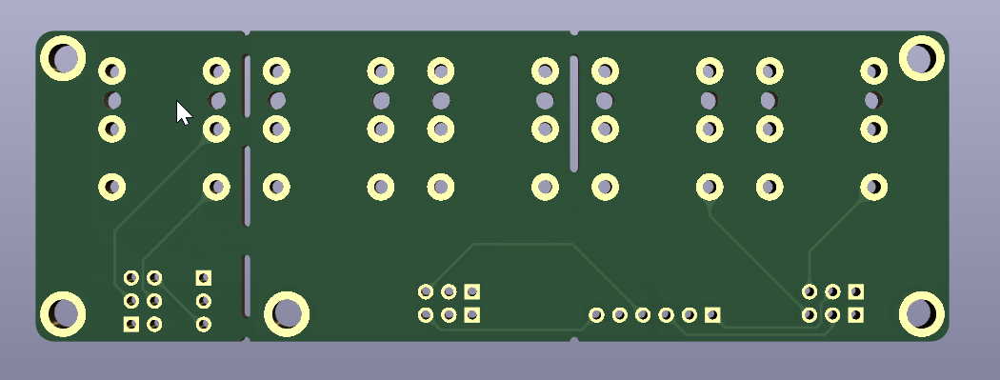

# ksoloti-audio-jack-board 

Five 6.35mm audio jacks with headers to interface with the Ksoloti Core's line i/o header and headphones header.

- Two mono line input jacks
- Two mono line output jacks
- One stereo headphones jack

Board dimensions: 100mm * 34mm
Jacks used: NRJ6HF
These are actually stereo jacks, but on the line i/o the ring terminals are not connected to anything. You could rewire them to get stereo line i/o or anything else.

!top PCB](img/top_pcb.png)

